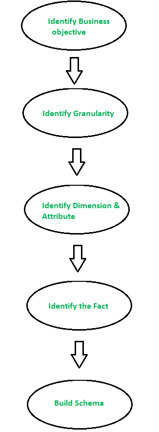

# DimensionalModeling
## Kimball's Dimensional Modeling techniques

### As Public Housing Agencies tend to inspect the development sites/ properties that are subsidized by HUD, and give Inspection Scores as well assign a certain performance Cost to the US  tax payers. 
####  As a Data Analyst, I have to consider common pitfalls while modeling the dimensional model, and to provide a key analysis which exactly fits the analysis.
####  DIMENSIONAL MODELS ADDRESSES THE PROBLEM OF OVERLY COMPLEX SCHEMA ,AND THEY ARE MOSRE ROBUST AS RDBMSs CAN'T QUERY NORMALIZATION MODELS EFFICIENTLY.

##### Identify Facts
As fact tables store the performance measurements, the facts are the measures or outcomes of an Inspection in this Scenario and they are continuous and sometimes discrete in nature.
I have identified 2 facts in the Dataset. 
1)	COST_OF_INSPECTION_IN_DOLLARS 2) INSPECTION_SCORE

##### Type of Facts
The types of facts are Transactional, Periodic Snapshots and Accumulated Snapshots. After checking the csv file, each row shows the measurement at a specific instant of time and I can’t find any Null Values/ Zero Values in the measurements. They are neither periodic measurements nor they include start and end process along with the periodic results. I see that not every Development site has been inspected more than once, and even though they have been inspected many number of times there is cyclicity or periodicity in the measurements and hence given measurements are Transactional Facts.

##### Identify the Dimensions
Dimensions can have textual\descriptive attributes, or it can be a time dimension where every transaction detail is captured. In the given data, there are 6 dimensions. Both Textual and Date Dimensions are observed.
PUBLIC_HOUSING_AGENCY_NAME
INSPECTED_DEVELOPMENT_NAME
INSPECTED_DEVELOPMENT_ADDRESS
INSPECTED_DEVELOPMENT_CITY
INSPECTED_DEVELOPMENT_STATE
INSPECTION_DATE

* * To capture the facts at an Inspection level instantaneously Transactional facts would be the choice because The Atomic Transaction grain fact tables are communicative and easily understandable to the end user and the rows/transactions exist only if measurements take place.
 Now, for a periodic summary of inspection for each month Periodic Snapshot Fact tables would suffice as they show summaries of many measurements occurring over a Standard Period. The grain will be the period, and even if no event takes place in a give cycle the entry of measurement takes place and the row gets inserted with value zero so that it will be easy for the end user to understand that it is a periodic measurement.
 
 * * The slow changes in Names and Addresses can be handled with the tracking techniques as described by Kimball. Type 0 is not appropriate as the dimension attribute shows no change. Also, Type 1 is not appropriate as the old one is replaced with the new one and when the aggregated facts gets recalculated it might be a problem as the Agencies would want to keep track of inspection scores and report the scores, overwriting the previous would cause confusion to the HUD’s. Type 2 would preserve the history of facts and they are assigned to the old value and inserts a new row for the changed dimension, and this would cause to enter new columns. Type 3 are needed when the user wants all the historical transactions, since in this case we would want only one previous and current value type 3 is not the right choice Type 2 along with a Time-Stamped approach would suffice.
 
 * * As the Management wants to check which Public Housing Agencies eevidenced a increase in COST with respect to previous Inspection, I attached a SQL file(Well commented) and that shows the calculations to get and OUTPUT that contains PHA's that have evidenced an increase in Cost and the % change in COST for those PHA's.

##### 
